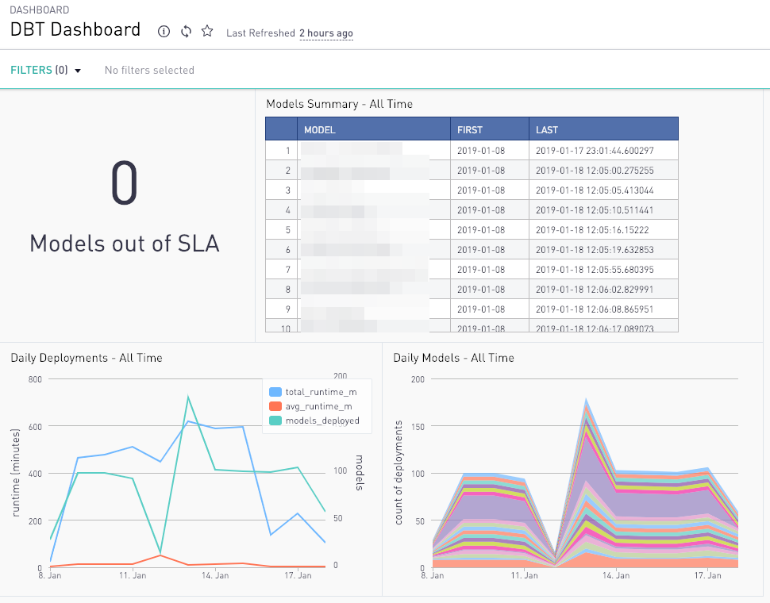

# Periscope Data DBT Dashboard

1. Run `dbt compile`
2. Create a dashboard in Periscope Data, name it e.g. DBT Dashboard
3. Enable filters for Aggregation and Date Range
4. Create a number overlay chart named Models out of SLA
5. Copy and paste the SQL from
   `target/compiled/logging/analysis/periscope/models_out_of_sla.sql`
6. Adjust SLA in the SQL query if desired (default is 24 hours)
7. Repeat for:
    - Table named Models Summary - [Daterange]
    - Line chart with two axes named [Aggregation] Deployments - [Daterange]
    - Area chart named [Aggregation] Models - [Daterange]
